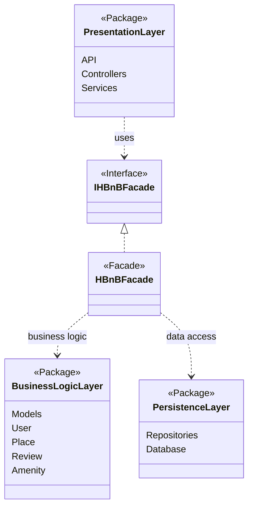

# Task 0: High-Level Package Diagram

## High-Level Package Diagram

## Explanatory Notes

## Presentation Layer (Services / API)
Handles client requests and API endpoints.  
Communicates with the business logic only through the facade interface.

## Business Logic Layer (Models)
Contains the core business logic and domain models.  
The facade provides a unified access point for operations.

## Persistence Layer
Responsible for data storage and retrieval through repositories.

## Facade Pattern
Provides a single interface to simplify communication between layers and reduce coupling.

