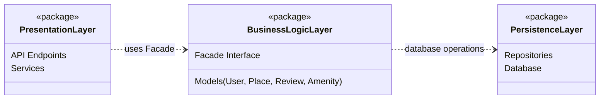

# 0. High-Level Package Diagram — HBnB Evolution

## High-Level Package Diagram (Mermaid)

## Explanatory Notes

### Presentation Layer (Services, API)
- Handles user interaction with the system through API endpoints and services.
- Validates and forwards requests to the Business Logic layer.
- Communicates with the Business Logic layer only via the Facade.
- Does not access the database directly.

### Business Logic Layer (Models)
- Contains the core business logic and validation rules.
- Holds the domain models: User, Place, Review, and Amenity.
- Exposes a unified Facade Interface used by the Presentation layer.
- Coordinates operations and delegates persistence operations to the Persistence layer.

### Persistence Layer
- Responsible for data storage and retrieval.
- Provides repositories (or DAO) to perform CRUD operations.
- Interacts with the database (implementation details are handled in Part 3).

### Facade Pattern
- Provides a single entry point from the Presentation layer to the Business Logic layer.
- Reduces coupling between layers and simplifies interactions.
- Helps keep responsibilities separated and makes future changes easier.
