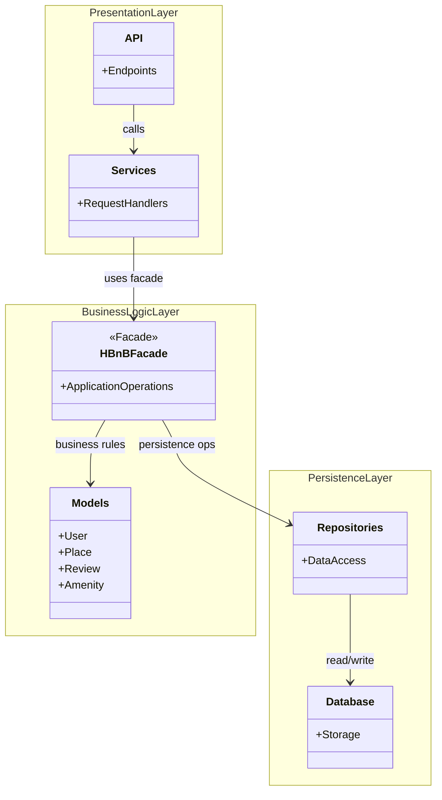

# Task 0: High-Level Package Diagram

## High-Level Package Diagram

## Explanatory Notes

### Presentation Layer (Services / API)
This layer is the entry point of the system.
It exposes API endpoints and services that receive client requests and forward them to the Business Logic layer through the facade.

### Business Logic Layer (Models)
This layer contains the core business logic and the domain models (User, Place, Review, Amenity).
The HBnBFacade provides a unified interface used by the Presentation layer to access the application functionality.

### Persistence Layer
This layer is responsible for data storage and retrieval.
It uses repositories (data access components) to interact with the database.

### Facade Pattern
The Facade pattern is represented by HBnBFacade.
It simplifies communication between the Presentation layer and the Business Logic layer by providing a single access point.
This approach reduces coupling and improves maintainability.

