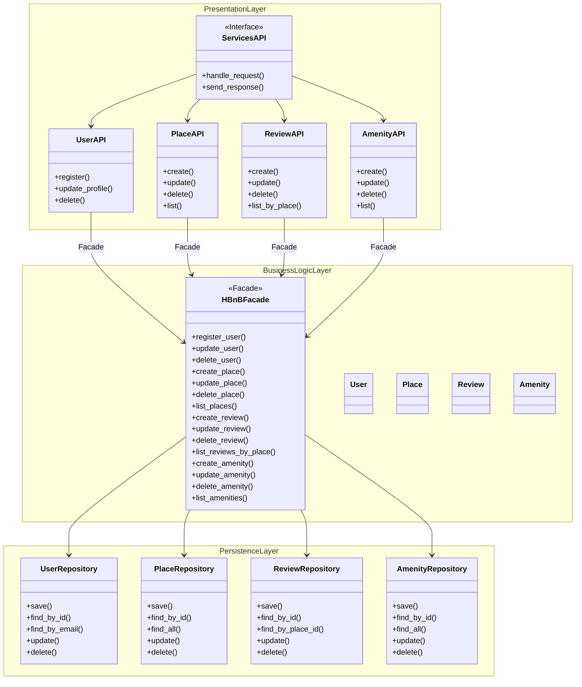

# Task 0: High-Level Package Diagram

## Objective
This diagram provides a high-level overview of the three-layer architecture of the HBnB application and shows how the layers communicate using the Facade design pattern.

## High-Level Package Diagram

## Explanatory Notes

### Presentation Layer (Services / API)
This layer represents the entry point of the system.
It exposes API endpoints and services that receive client requests and forward them to the Business Logic layer through the facade.

### Business Logic Layer (Models)
This layer contains the core business rules and the domain models, including User, Place, Review, and Amenity.
The HBnBFacade provides a unified interface that is used by the Presentation layer to interact with the business logic.

### Persistence Layer
This layer is responsible for data storage and retrieval.
It interacts directly with the database through repositories, abstracting database operations from the business logic.

### Facade Pattern
The Facade pattern simplifies communication between the Presentation and Business Logic layers by providing a single access point to the system’s core functionality.
This approach reduces coupling between components and improves the maintainability and clarity of the application architecture.

