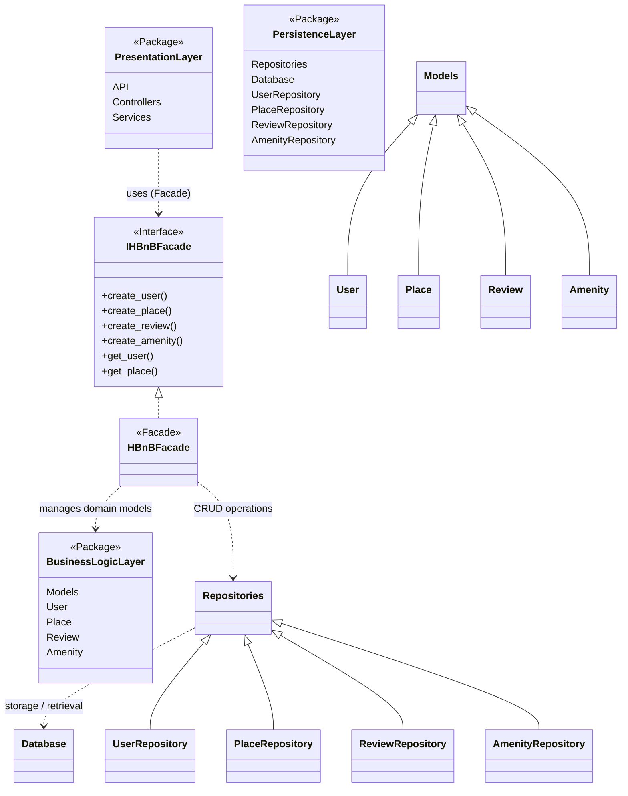

# Task 0: High-Level Package Diagram

## High-Level Package Diagram

## Explanatory Notes

## Presentation Layer (Services / API)
This layer represents the entry point of the application.  
It exposes API endpoints, controllers, and services that receive and handle client requests.  
The presentation layer communicates with the business logic only through the facade interface (`IHBnBFacade`), avoiding direct dependency on internal models or persistence code.

## Business Logic Layer (Models)
This layer contains the core business rules and the main domain models: User, Place, Review, and Amenity.  
HBnBFacade implements the facade interface (`IHBnBFacade`) and provides a unified access point for the presentation layer.  
It applies validations and coordinates actions across models and persistence components.

## Persistence Layer
This layer is responsible for data storage and retrieval.  
Repositories (e.g., UserRepository, PlaceRepository) perform CRUD operations and communicate with the database.  
The business logic layer uses repositories instead of accessing the database directly.

## Facade Pattern
The facade pattern is represented by the interface `IHBnBFacade` and its implementation `HBnBFacade`.  
It simplifies communication between layers by providing a single entry point to business operations.  
This reduces coupling between the presentation layer and the internal system components, improving maintainability and clarity.

