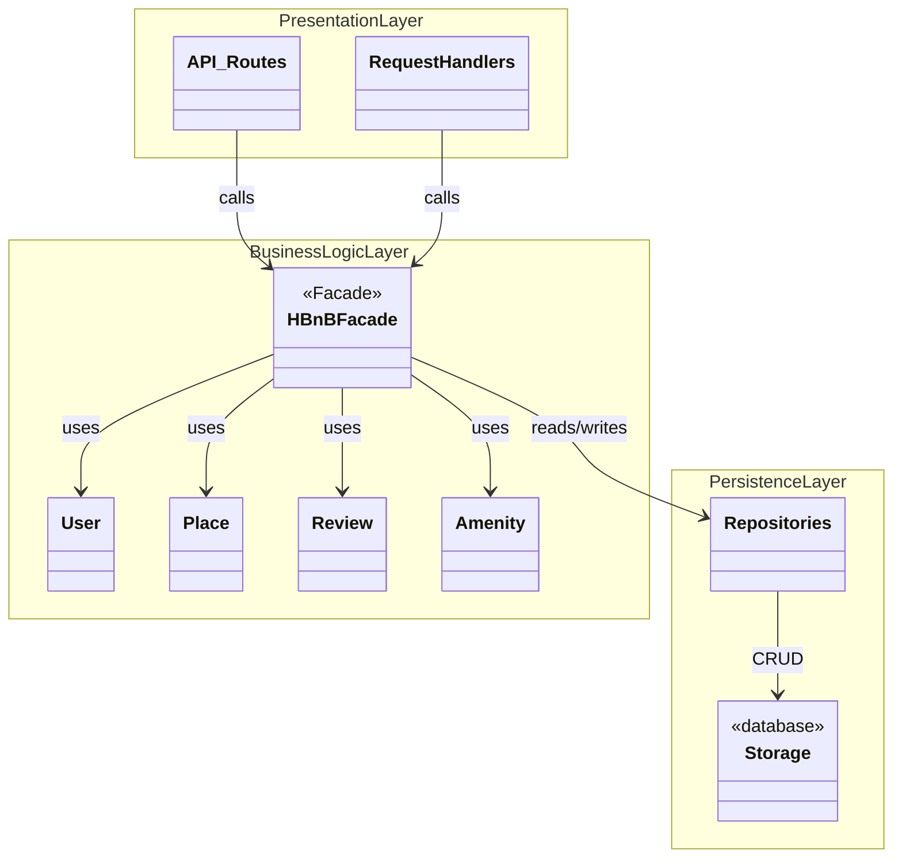

# Task 0: High-Level Package Diagram

## High-Level Package Diagram

## Explanatory Notes

### Presentation Layer (Services / API)
This layer represents the entry point of the application.
It is responsible for handling user interactions and HTTP requests.
All incoming requests are forwarded to the Business Logic layer through
the facade, without containing any core business rules.

### Business Logic Layer (Models)
This layer contains the core business logic of the application.
It includes the domain models (User, Place, Review, Amenity) and the
HBnBFacade, which provides a unified interface for the Presentation layer
to access business operations.

### Persistence Layer
This layer is responsible for data storage and retrieval.
It manages interactions with the database through repositories or
data access objects, abstracting storage details from the business logic.

### Facade Pattern
The Facade pattern simplifies communication between layers by providing
a single entry point to the Business Logic layer.
It hides internal complexity, reduces coupling between components,
and improves maintainability and clarity of the overall architecture.

