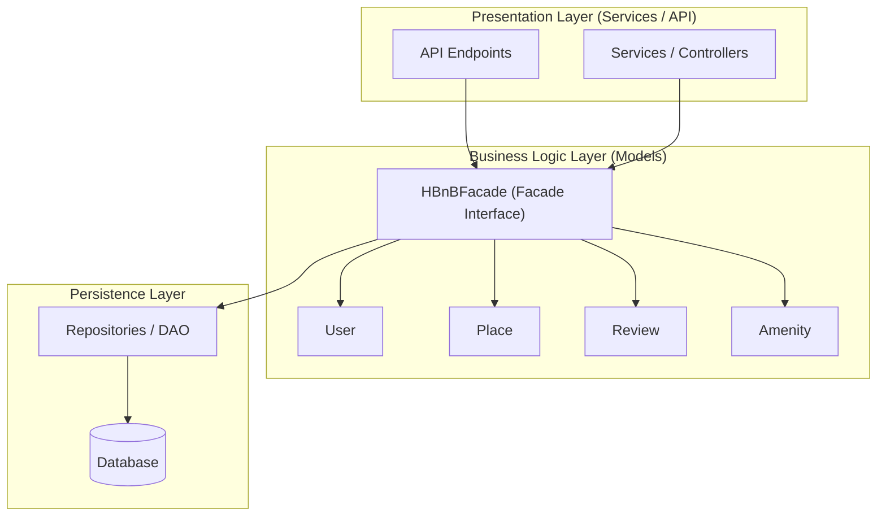

# Task 0: High-Level Package Diagram

## Overview
This diagram illustrates the three-layer architecture of the HBnB application and the communication between these layers using the Facade design pattern.

## UML Package Diagram

## Explanatory Notes

### Presentation Layer (Services / API)
This layer handles user interactions and HTTP requests. It exposes API endpoints and services that forward requests to the business logic layer through the facade.

### Business Logic Layer (Models)
This layer contains the core business logic and the domain models (User, Place, Review, Amenity).
The HBnBFacade provides a unified interface for the presentation layer.

### Persistence Layer
This layer manages data storage and retrieval through repositories or data access objects that interact with the database.

### Facade Pattern
The facade pattern simplifies communication between layers by providing a single entry point to the business logic, reducing coupling between components.

