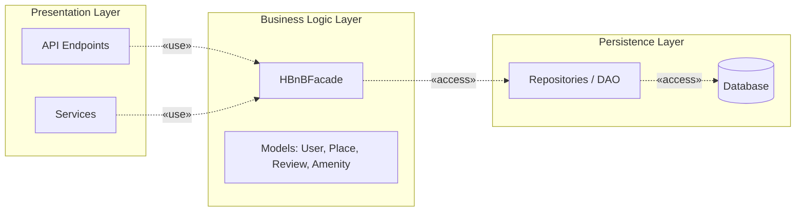

# 0. High-Level Package Diagram

## UML Package Diagram

## Explanatory Notes

### Presentation Layer (Services, API)
Handles user interaction and HTTP requests. It exposes API endpoints and services that forward requests to the business logic through the facade.

### Business Logic Layer (Models)
Contains the core business logic and domain models (User, Place, Review, Amenity).  
The HBnBFacade provides a unified interface used by the presentation layer.

### Persistence Layer
Responsible for data storage and retrieval. It interacts with the database through repositories or data access objects.

### Facade Pattern
The HBnBFacade simplifies communication between layers by providing a single entry point to the business logic, reducing coupling between components.

