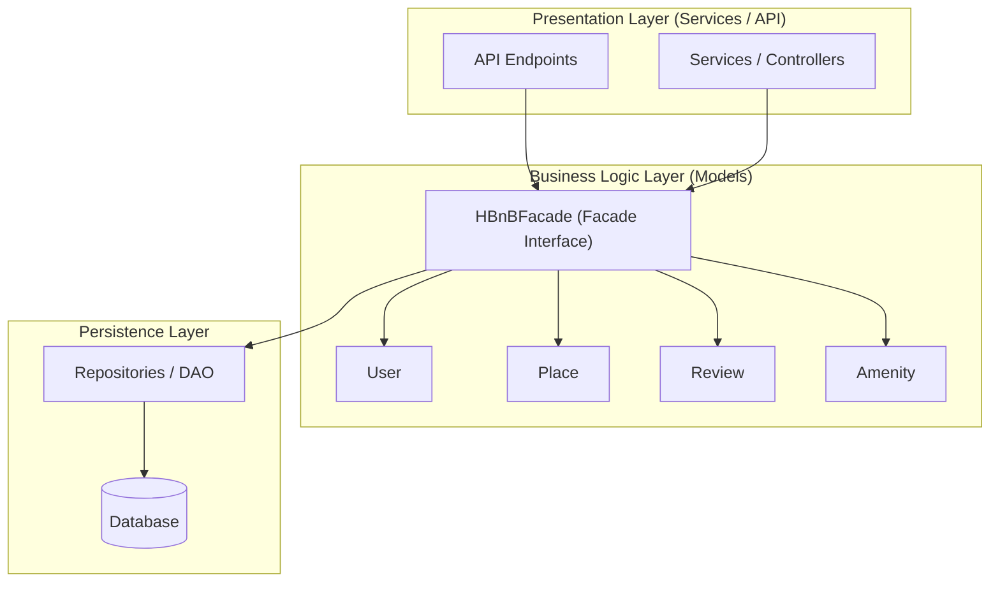

# Task 0: High-Level Package Diagram

## Diagram

## Explanatory Notes

### Presentation Layer (Services / API)
This layer represents the entry point of the system.
It exposes API endpoints and services that receive client requests and forward them to the business logic layer through the facade.

### Business Logic Layer (Models)
This layer contains the core business rules and the domain models (User, Place, Review, Amenity).
It also includes the HBnBFacade, which provides a unified interface used by the presentation layer.

### Persistence Layer
This layer is responsible for data storage and retrieval.
It interacts with the database through repositories or data access objects.

### Facade Pattern
The Facade pattern simplifies communication between layers by providing a single access point to the business logic.
This reduces coupling between layers and improves maintainability and clarity of the architecture.

