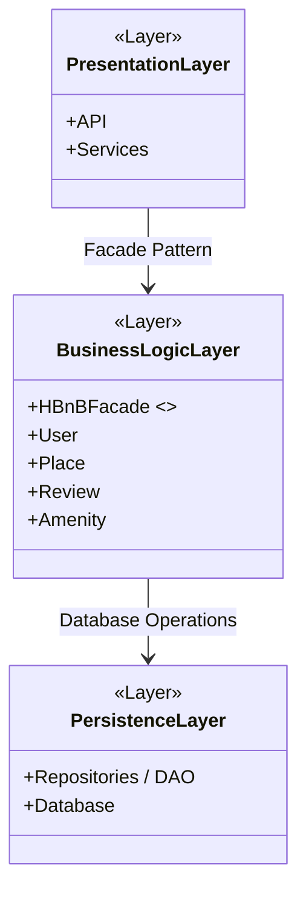

# 0. High-Level Package Diagram

## UML Package Diagram

## Explanatory Notes

### Presentation Layer (Services, API)
This layer is responsible for handling interactions between users and the application.
It exposes API endpoints and services that receive client requests and forward them to the business logic layer.

### Business Logic Layer (Models)
This layer contains the core business logic and the main domain models of the application:
User, Place, Review, and Amenity.
It also includes the HBnBFacade, which provides a unified interface used by the presentation layer.

### Persistence Layer
This layer handles data storage and retrieval.
It interacts directly with the database through repositories or data access objects.

### Facade Pattern
The facade pattern is implemented through the HBnBFacade.
It simplifies communication by allowing the presentation layer to interact with a single interface
instead of directly accessing multiple components, reducing coupling between layers.
