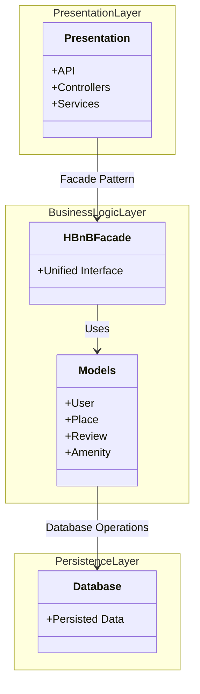

# Task 0: High-Level Package Diagram

## High-Level Package Diagram

###Explanatory Notes
###Presentation Layer (Services / API)

Handles client interaction and HTTP requests through API endpoints, controllers, and services.
It forwards requests to the Business Logic layer via the facade.

###Business Logic Layer (Models)

Contains the domain models (User, Place, Review, Amenity) and core business rules.
The HBnBFacade provides a unified entry point used by the Presentation layer.

###Persistence Layer

Responsible for persisting and retrieving data from the database (implemented in Part 3).

###Facade Pattern

The facade simplifies communication between layers by providing a single access point to the business logic, reducing coupling and improving maintainability.
