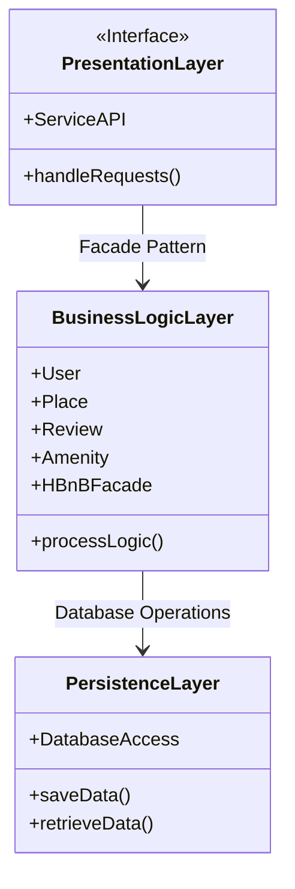

# Task 0: High-Level Package Diagram

## High-Level Diagram (Boxes + Arrows style)

## Explanatory Notes

### Presentation Layer (Services / API)
This layer represents the entry point of the system.
It exposes API endpoints and services that handle client requests.
Requests are validated and forwarded to the Business Logic Layer through the Facade.

### Business Logic Layer (Models)
This layer contains the core business rules and domain models such as User, Place, Review, and Amenity.
It also includes the HBnBFacade, which acts as a unified interface between the Presentation Layer and the internal system components.

### Persistence Layer
This layer is responsible for data storage and retrieval.
It communicates with the database through repositories or data access objects.
This layer is accessed only by the Business Logic Layer.

### Facade Pattern
The Facade Pattern provides a single access point to the Business Logic Layer.
It simplifies communication between layers and hides internal implementation details.
This approach reduces coupling and improves maintainability, scalability, and clarity of the system architecture.

