# Task 0: High-Level Package Diagram

## Overview
This package diagram provides a high-level architectural overview of the HBnB Evolution application.  
It illustrates the three-layer architecture and shows how the layers communicate using the Facade design pattern.

## UML Package Diagram

```mermaid
flowchart TB
  %% Packages
  Presentation["📁 Presentation Layer\n(Services / API)"]
  Business["📁 Business Logic Layer\n(Models + Facade)"]
  Persistence["📁 Persistence Layer\n(Repository / Database)"]

  %% Dependencies
  Presentation -. "«use» Facade" .-> Business
  Business -. "«use»" .-> Persistence
```

## Explanatory Notes

### Presentation Layer (Services / API)
The Presentation Layer represents the entry point of the system.
It exposes API endpoints and services that receive client requests and delegate processing to the business logic layer via the facade.

### Business Logic Layer (Models)
The Business Logic Layer contains the core business rules and domain models such as User, Place, Review, and Amenity.
It also includes the HBnBFacade, which acts as a unified interface between the presentation and persistence layers.

### Persistence Layer
The Persistence Layer is responsible for data storage and retrieval.
It provides repositories or data access objects that interact directly with the database.

### Facade Pattern
The Facade pattern simplifies inter-layer communication by providing a single access point to the business logic.
This reduces coupling between layers and improves maintainability and clarity of the architecture.

