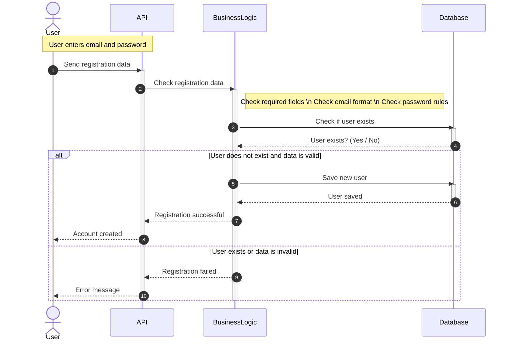
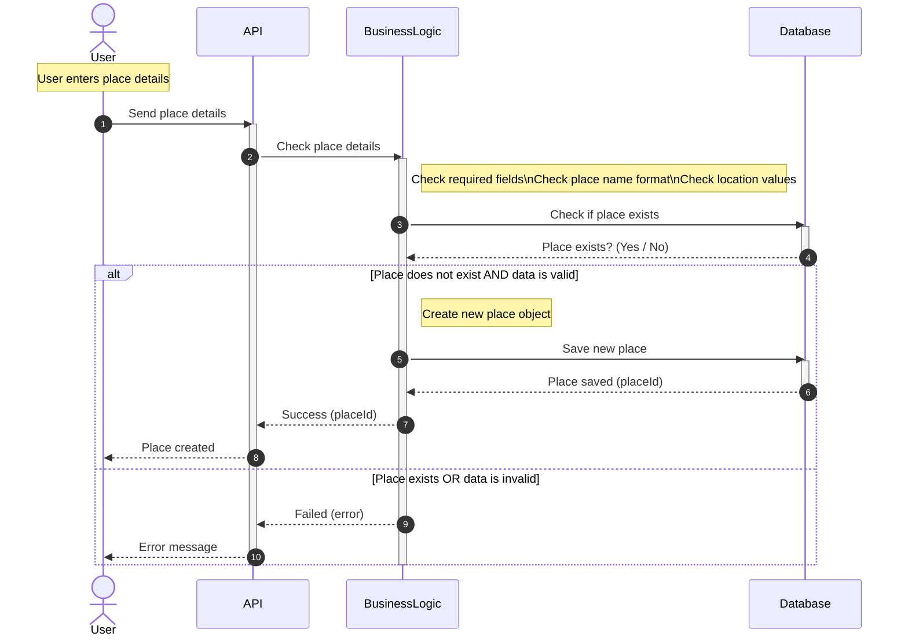
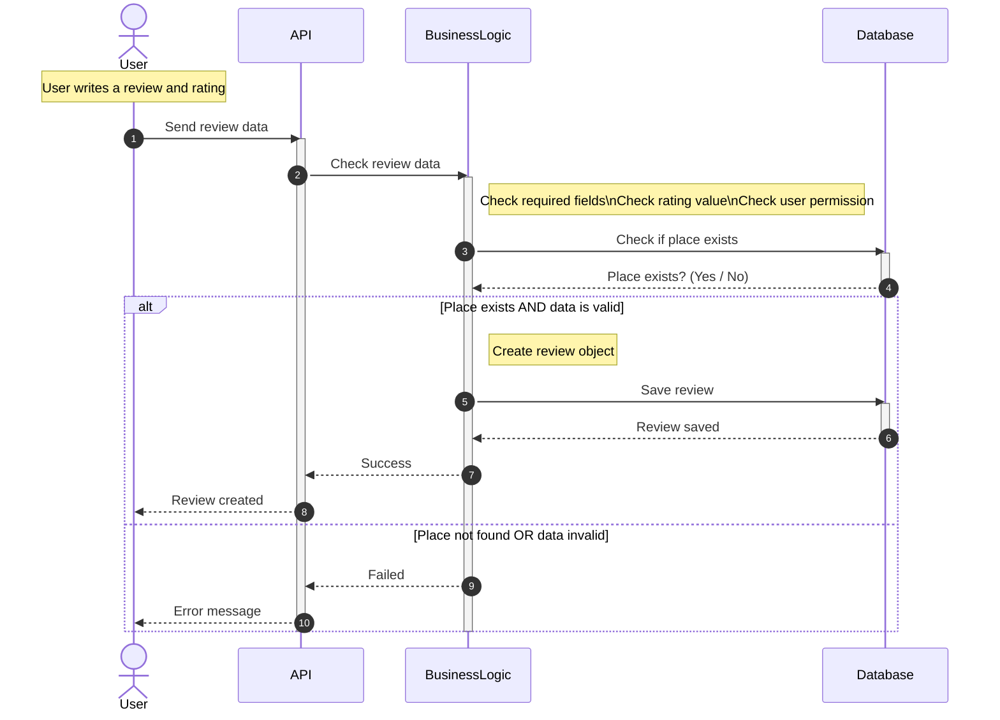
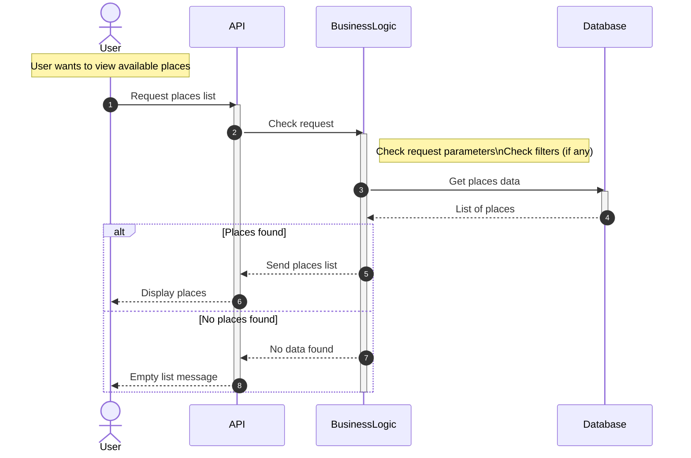

## 1. User Registration

# Explanation

	-	The user enters an email and password to create a new account.
	-	The API receives the registration data from the user.
	-	The API sends the data to the Business Logic layer for checking.
	-	The Business Logic checks:
	-	if all required fields are filled,
	-	if the email format is correct,
	-	if the password follows the rules.
	-	The Business Logic asks the Database if the user already exists.

If the data is valid and the user does not exist:

	-	The Business Logic saves the new user in the Database.
	-	The Database confirms that the user is saved.
	-	A success message is returned to the user.

If the data is invalid or the user already exists:

	-	An error message is returned to the user.
	

## 2. Place Creation

## Explanation

    -	 The user enters the place details (name, location, etc.).
	•	The API receives the place details from the user.
	•	The API sends the details to the Business Logic.
	•	The Business Logic checks:
	•	required fields,
	•	place name format,
	•	location values,
	•	and whether the place already exists.
	•	If the data is valid and the place does not exist:
	•	the place is saved in the database,
	•	a success message is returned to the user.
	•	If the place exists or the data is invalid:
	•	an error message is returned to the user.
-
	## 3. Review submission

# Explanation
	•	The user writes a review and gives a rating for a place.
	•	The API receives the review information from the user.
	•	The API sends the data to the Business Logic layer.
	•	The Business Logic checks:
	•	that all required fields are filled,
	•	that the rating value is valid,
	•	that the user is allowed to add a review,
	•	and that the place exists.
	•	If the data is valid and the place exists:
	•	the review is saved in the database,
	•	a success message is sent back to the user.
	•	If the data is invalid or the place does not exist:
	•	an error message is returned to the user.

# 4. Fetch Places

# Explanation
	•	The user requests the list of places.
	•	The API sends the request to Business Logic.
	•	Business Logic checks parameters/filters and queries the database.
	•	If places are found, the list is returned to the user.
	•	If none are found, an empty list message is returned.
