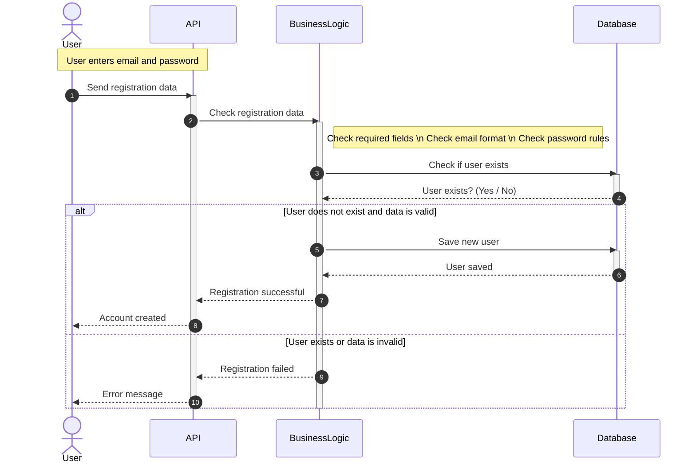

## 1. User Registration

# Explanation

	-	The user enters an email and password to create a new account.
	-	The API receives the registration data from the user.
	-	The API sends the data to the Business Logic layer for checking.
	-	The Business Logic checks:
	-	if all required fields are filled,
	-	if the email format is correct,
	-	if the password follows the rules.
	-	The Business Logic asks the Database if the user already exists.

If the data is valid and the user does not exist:

	-	The Business Logic saves the new user in the Database.
	-	The Database confirms that the user is saved.
	-	A success message is returned to the user.

If the data is invalid or the user already exists:

	-	An error message is returned to the user.

